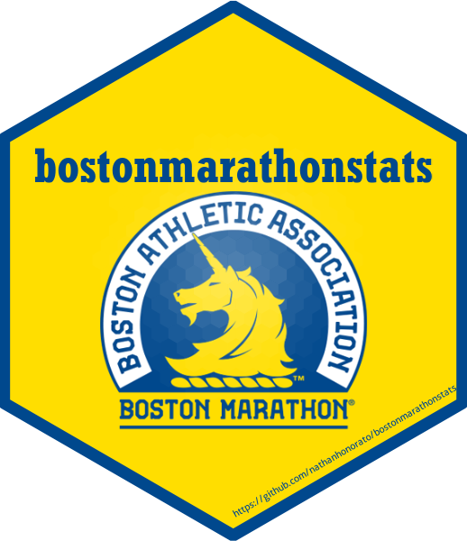
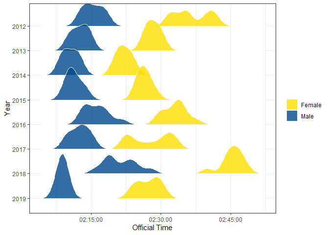

<!-- README.md is generated from README.Rmd. Please edit that file -->

# bostonmarathonstats <a href="https://github.com/nathanhonorato/bostonmarathonstats"></a>

<!-- badges: start -->

[](https://github.com/nathanhonorato/bostonmarathonstats/actions/workflows/R-CMD-check.yaml)
<!-- badges: end -->

## Overview

bostonmarathonstats provides an easy way to analyze data of runners that
finished the Boston Marathon from 2009 to 2022.

- `boston_summary()` summarises data of an year.
- `boston_position` searches the athletes that finished in a certain
  position.
- `boston_country` summarises data of a country.
- `boston_athlete` searches results of an athlete.
- `boston_density_ridges()` make a density plot of the amount of runners
  over the finishing time.

## Installation

You can install the development version of bostonmarathonstats from
[GitHub](https://github.com/) with:

``` r
# install.packages("devtools")
devtools::install_github("nathanhonorato/bostonmarathonstats")
```

## Examples

This is a basic example of one of the functions of this package.
`boston_summary` informs the numbers of finishers by gender of a certain
year of event.

``` r
library(bostonmarathonstats)
boston_summary(gender = "Female", year = 2021)
#> # A tibble: 1 × 7
#>   gender  year n_finishers mean_age n_countries fastest_time slowest_time
#>   <chr>  <int>       <int>    <dbl>       <int> <Period>     <Period>    
#> 1 Female  2021        7444     43.0          64 2H 24M 45S   7H 33M 22S
```

These are the first few rows of the database `results_boston` used in
this package called. It has data about the runners such as gender,
residence information and finishing time.

``` r
head(results_boston, 5) |> 
  knitr::kable()
```

| Year | FullName         | AgeOnRaceDay | Gender | City          | StateAbbrev | StateName  | Zip | CountryOfResAbbrev | CountryOfResName         | CountryOfCtzAbbrev | CountryOfCtzName         | OfficialTime | RankOverall | RankOverGender | RankOverDivision | SubGroupLabel | SubGroup |
|-----:|:-----------------|-------------:|:-------|:--------------|:------------|:-----------|:----|:-------------------|:-------------------------|:-------------------|:-------------------------|:-------------|------------:|---------------:|-----------------:|:--------------|:---------|
| 2009 | Deriba Merga     |           28 | Male   | Addis Ababa   | NA          | NA         | NA  | ETH                | Ethiopia                 | ETH                | Ethiopia                 | 7722 secs    |           1 |              1 |                1 | NA            | NA       |
| 2009 | Daniel Rono      |           30 | Male   | Keiyo         | NA          | NA         | NA  | KEN                | Kenya                    | KEN                | Kenya                    | 7772 secs    |           2 |              2 |                2 | NA            | NA       |
| 2009 | Ryan Hall        |           26 | Male   | Mammoth Lakes | CA          | California | NA  | USA                | United States of America | USA                | United States of America | 7780 secs    |           3 |              3 |                3 | NA            | NA       |
| 2009 | Tekeste Kebede   |           27 | Male   | Addis Ababa   | NA          | NA         | NA  | ETH                | Ethiopia                 | ETH                | Ethiopia                 | 7789 secs    |           4 |              4 |                4 | NA            | NA       |
| 2009 | Robert Cheruiyot |           20 | Male   | Bomet         | NA          | NA         | NA  | KEN                | Kenya                    | KEN                | Kenya                    | 7806 secs    |           5 |              5 |                5 | NA            | NA       |

This package also has the function `boston_density_ridges()` to make a
density plot of finishing times:

    #> Picking joint bandwidth of 74.7


